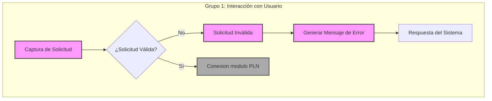

# Procesamiento-de-voz
-

```mermaid
graph TD
    subgraph Grupo1 [Grupo 1: Interacción con Usuario]
        A[Captura de Solicitud]
        A:::method --> B{¿Solicitud Válida?}
        
        B -->|No| C[Solicitud Inválida]
        C:::method --> D[Generar Mensaje de Error]
        D:::method --> E[Respuesta del Sistema]

        B -->|Sí| F[Conexion modulo PLN]
        F:::method2
        
        
        
        end

    classDef method fill:#f9f,stroke:#333,stroke-width:2px;
    classDef method2 fill:#aaa,stroke:#444,stroke-width:2px;
```
