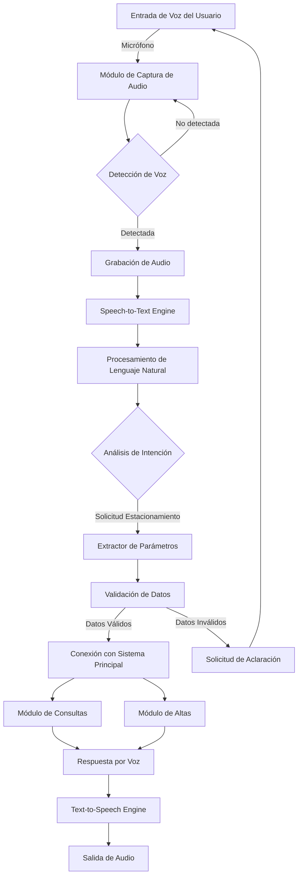

# Procesamiento-de-voz
-

```mermaid
graph TD
    A[Entrada de Voz del Usuario] -->|Micrófono| B[Módulo de Captura de Audio]
    B --> C{Detección de Voz}
    C -->|No detectada| B
    C -->|Detectada| D[Grabación de Audio]
    D --> E[Speech-to-Text Engine]
    E --> F[Procesamiento de Lenguaje Natural]
    F --> G{Análisis de Intención}
    
    G -->|Solicitud Estacionamiento| H[Extractor de Parámetros]
    H --> I[Validación de Datos]
    I -->|Datos Válidos| J[Conexión con Sistema Principal]
    I -->|Datos Inválidos| K[Solicitud de Aclaración]
    K --> A
    
    J --> L[Módulo de Consultas]
    J --> M[Módulo de Altas]
    
    L --> N[Respuesta por Voz]
    M --> N
    N --> O[Text-to-Speech Engine]
    O --> P[Salida de Audio]
```
