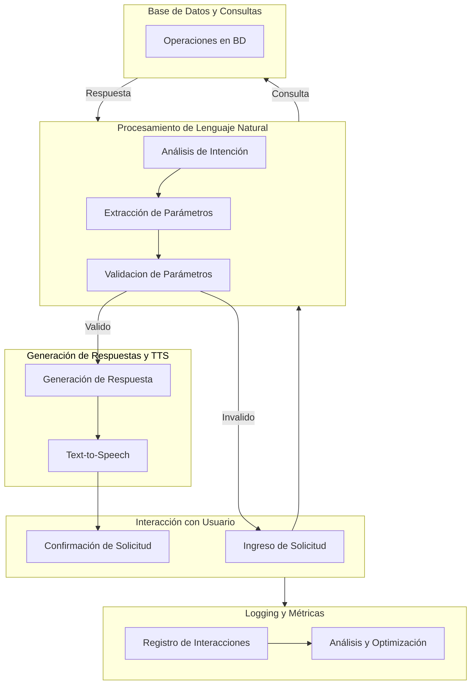
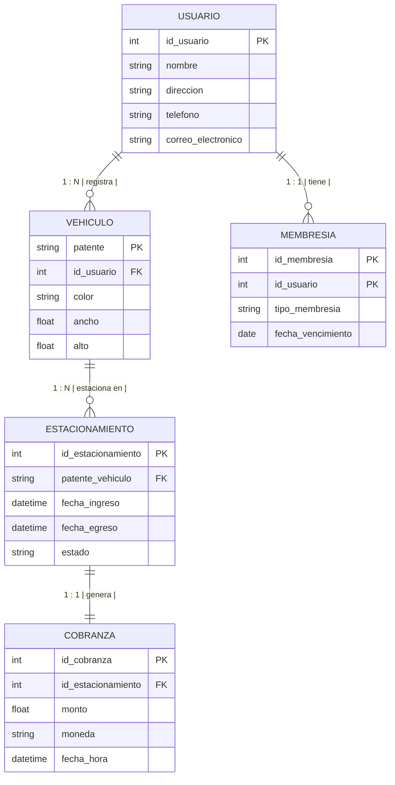

# Procesamiento-de-voz
-

```mermaid
flowchart TD
 subgraph Grupo1["Interacción con Usuario"]
        A1["Ingreso de Solicitud"]
        A2["Confirmación de Solicitud"]
  end
 subgraph Grupo2["Procesamiento de Lenguaje Natural"]
        B1["Análisis de Intención"]
        B2["Extracción de Parámetros"]
        B3["Validacion de Parámetros"]
  end
 subgraph Grupo3["Base de Datos y Consultas"]
        
        C2["Operaciones en BD"]
  end
 subgraph Grupo4["Generación de Respuestas y TTS"]
        D1["Generación de Respuesta"]
        D2["Text-to-Speech"]
  end
 subgraph Grupo5["Logging y Métricas"]
        E1["Registro de Interacciones"]
        E2["Análisis y Optimización"]
  end
    A1 -->Grupo2
    B1 --> B2
    B2 --> B3
    Grupo2 -- Consulta --> Grupo3
    Grupo3 -- Respuesta --> Grupo2
    
    B3 -- Valido --> D1
    B3 -- Invalido --> A1
    D1 --> D2
    D2 --> A2
    Grupo1 --> Grupo5
    E1 --> E2

    style Grupo4 color:#000000
```

## Diseño base de datos:

```mermaid
erDiagram
    USUARIO {
        int id_usuario PK
        string nombre
        string direccion
        string telefono
        string correo_electronico
    }

    VEHICULO {
        string patente PK
        int id_usuario FK
        string color
        float ancho
        float alto
    }

    ESTACIONAMIENTO {
        int id_estacionamiento PK
        string patente_vehiculo FK
        datetime fecha_ingreso
        datetime fecha_egreso
        string estado
    }

    COBRANZA {
        int id_cobranza PK
        int id_estacionamiento FK
        float monto
        string moneda
        datetime fecha_hora
    }

    %%PRECIO {
        %%int id_precio PK
        %%int tiempo_en_horas
        %%float monto
        %%string moneda
    %%}

    MEMBRESIA {
        int id_membresia PK
        int id_usuario PK
        string tipo_membresia
        date fecha_vencimiento
    }

    USUARIO ||--o{ VEHICULO : "1 : N | registra | "
    VEHICULO ||--o{ ESTACIONAMIENTO : "1 : N | estaciona en | "
    ESTACIONAMIENTO ||--|| COBRANZA : "1 : 1 | genera | "
    USUARIO ||--o{ MEMBRESIA : "1 : 1 | tiene | "
```

## Modulos de Trabajo

```mermaid
flowchart TD
 subgraph Grupo1["Interacción con Usuario"]
        A1["Ingreso de Solicitud"]
        A2["Confirmación de Solicitud"]
  end
 subgraph Grupo2["Procesamiento de Lenguaje Natural"]
        B1["Análisis de Intención"]
        B2["Extracción de Parámetros"]
        B3["Validacion de Parámetros"]
  end
 subgraph Grupo3["Base de Datos y Consultas"]
        
        C2["Operaciones en BD"]
  end
 subgraph Grupo4["Generación de Respuestas y TTS"]
        D1["Generación de Respuesta"]
        D2["Text-to-Speech"]
  end
 subgraph Grupo5["Logging y Métricas"]
        E1["Registro de Interacciones"]
        E2["Análisis y Optimización"]
  end
    A1 -->Grupo2
    B1 --> B2
    B2 --> B3
    Grupo2 -- Consulta --> Grupo3
    Grupo3 -- Respuesta --> Grupo2
    
    B3 -- Valido --> D1
    B3 -- Invalido --> A1
    D1 --> D2
    D2 --> A2
    Grupo1 --> Grupo5
    E1 --> E2

    style Grupo4 color:#000000
```